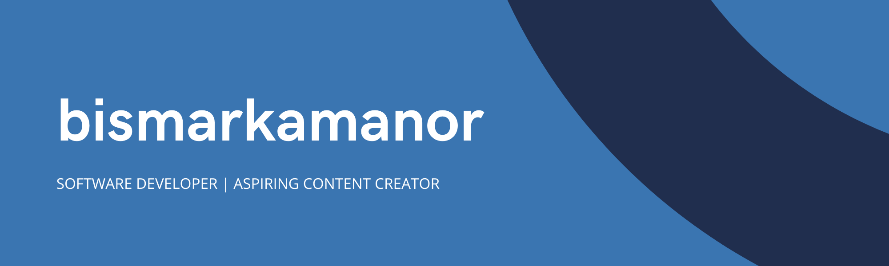

<!--
**bismarkamanor/bismarkamanor** is a ✨ _special_ ✨ repository because its `README.md` (this file) appears on your GitHub profile.

Here are some ideas to get you started:

- 🔭 I’m currently working on ...
- 🌱 I’m currently learning ...
- 👯 I’m looking to collaborate on ...
- 🤔 I’m looking for help with ...
- 💬 Ask me about ...
- 📫 How to reach me: ...
- 😄 Pronouns: ...
- ⚡ Fun fact: ...
-->

### Hi there. I am [Bismark Amanor](https://bismarkamanor.vercel.app/) 👋

I'm a software developer and designer based in **Ghana, West Africa**. I am currently working as a front-end developer at **Quacker Technologies Ghana**. I love **playing video games**, **swimming**, **listening to music** and **programming** 🥰

## What I'm currently working on

1.  Expense tracker app built with react-native
2.  Building my Tech startup

## Follow me on

<!--**Github** | **Facebook** | **Twitter** | **LinkedIn** | **Youtube** -->

## My hard skills

**Front-end:**

- React and React Native
- HTML, CSS, JavaScript

**Back-end:**

- Firebase
- MySQL

**People Skills:**

- Good communication skills
- Good team player
- Good presentation skills

**Degree's and Certificates:**

- BSc. Computer Science - Regional Maritime University, Ghana
- [Responsive Web Design Certificate - Freecodecamp.org](https://freecodecamp.org/certification/bismarkokletey/responsive-web-design)

1.  Expense tracker app built with react-native
2.  Building my Tech startup

## Follow me on

**Github** | **Facebook** | **Twitter** | **LinkedIn** | **Youtube**

## My hard skills

**Front-end:**

- React and React Native
- HTML, CSS, JavaScript

**Back-end:**

- Firebase
- MySQL

**People Skills:**

- Good communication skills
- Good team player
- Good presentation skills

**Degree's and Certificates:**

- BSc. Computer Science - Regional Maritime University, Ghana
- [Responsive Web Design Certificate - Freecodecamp.org](https://freecodecamp.org/certification/bismarkokletey/responsive-web-design)

## Languages and tools

**React JS** | **React Native** | **HTML, CSS, JavaScript** | **Node JS** | **Firebase** | **MySQL** |

## More about me

